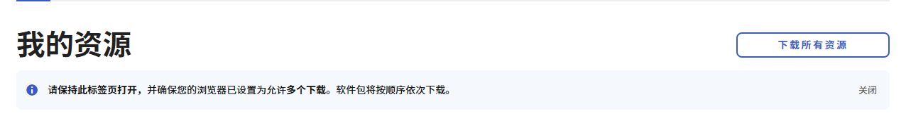

# Unity Asset Store 批量下载器

> 革命不是请客吃饭，不是做文章，不是绘画画像，而是要打倒一切牛鬼蛇神。  
> 网络不畅通可以考虑切换三种下载方式（Edge/Chrome/内置 Chromium）

一键批量下载你在 Unity Asset Store 购买的所有资源，告别手动一个个点击下载的烦恼。

## 这个工具能做什么？

**如果你有以下困扰，这个工具就是为你准备的：**

- 😫 在 Asset Store 买了几十个、上百个资源，一个个点下载太麻烦
- 😤 想重装系统或换电脑，要把所有资源重新下载一遍
- 😵 想备份自己购买的资源，但官方不提供批量导出功能
- 😴 下载过程中断，不知道哪些下了、哪些没下

**这个工具可以帮你：**

- ✅ 一键下载所有已购资源（自动排队，无需值守）
- ✅ 智能跳过已下载的文件（不重复下载）
- ✅ 自动重试失败的下载（网络波动也不怕）
- ✅ 断点续传（中断后重新运行，自动继续）

## 使用步骤

### 第一步：安装依赖

双击运行 `run.bat`，选择菜单 `[4] 安装依赖`，等待安装完成。

### 第二步：开始下载

1. 运行 `run.bat`
2. 选择 `[1] 下载我的所有资源（显示浏览器）`
3. 选择浏览器：`Edge` / `Chrome` / 直接回车使用内置 `Chromium`
4. 输入下载保存路径（直接回车使用默认 `Downloads\UnityAssets`）
5. 在打开的浏览器中登录你的 Unity 账户
6. 程序会自动开始下载所有资源

### 按钮说明

开始下载前，请先打开 Unity Asset Store 资产页：
https://assetstore.unity.com/account/assets

当页面出现“下载所有资源”按钮（如下图）时，再使用本工具：



### 第三步：等待完成

- 下载的文件会保存在 `下载/UnityAssets/` 文件夹
- 程序会显示下载进度：成功多少个、跳过多少个、失败多少个
- 完成后按任意键返回菜单

## 下载路径

- 支持在开始下载时输入自定义保存路径；直接回车使用默认路径
- 默认保存在：
```
C:\Users\你的用户名\Downloads\UnityAssets\
```

## 浏览器选择与依赖说明

- 启动下载时可选择：
  - `1` 使用系统 Microsoft Edge
  - `2` 使用系统 Google Chrome
  - 直接回车使用 Playwright 内置 Chromium
- 依赖提示：
  - 三种方式都需要先安装 Python 依赖（菜单 `[4] 安装依赖`）
  - 仅当使用内置 Chromium（直接回车）时，才需要额外安装浏览器内核：
    可手动下载浏览器内核并放置到指定位置：  
    https://cdn.playwright.dev/chrome-for-testing-public/145.0.7632.6/win64/chrome-win64.zip  
    将压缩包解压至：C:\Users\用户名\AppData\Local\ms-playwright\chromium-1208  
    确保最终存在：C:\Users\用户名\AppData\Local\ms-playwright\chromium-1208\chrome-win64\chrome.exe
  - 如果长期用 Edge/Chrome，可不安装内置 Chromium

## 菜单说明

运行 `run.bat` 后会出现以下菜单：

| 选项 | 功能 |
|------|------|
| `[1]` | 下载所有资源（显示浏览器窗口） |
| `[2]` | 下载所有资源（无头模式，后台运行） |
| `[3]` | **扫描并导入资源到 Unity** |
| `[4]` | 安装依赖 |
| `[5]` | 查看帮助 |
| `[6]` | 退出 |

### 选项3：导入资源到 Unity

选择 `[3]` 后，会列出所有已下载的资源：

```
================================================================================
  Unity Asset Store 资源列表
  [←↑↓→ 选择资源]  [Enter 导入]  [A 全部导入]  [Q 退出]
================================================================================

    1. 资源名A                    发布商A         50.5 MB    
  ▶ 2. 选中的资源                发布商B         25.0 MB    ◀ 当前选中
    3. 资源名C                    发布商C         120.3 MB   

  共 100 个资源
```

**操作说明：**
- `↑` `↓` - 上下选择资源（长按加速滚动）
- `←` `→` - 翻页（向左/向右翻一页）
- `Enter` - 导入当前选中的资源到 Unity
- `A` - 逐个导入所有资源
- `Q` - 退出

**注意：** 导入前请确保 Unity 编辑器已打开，导入时会自动弹出 Unity 的导入对话框。

## 常见问题

### Q: 下载速度很慢怎么办？

**A:** 可在开始下载时切换为不同的下载方式（Edge、Chrome 或内置 Chromium），不同方式的网络路径可能不同，通常能改善稳定性与速度。

### Q: 为什么有些文件下载失败？

**A:** 常见原因：
- 网络波动（程序会自动重试）
- 资源已被作者下架
- Unity 服务器限制

失败的文件会记录在 `unity_failed_downloads.json`，下次运行会重新尝试下载。

### Q: 我已经下载了一部分，重新运行会重复下载吗？

**A:** 不会。程序会自动检测已存在的文件并跳过，只会下载新增或失败的文件。

### Q: 可以后台运行吗？

**A:** 可以。选择 `[2] 下载我的所有资源（无头模式）`，浏览器窗口不会显示，在后台静默下载。

### Q: 下载的资源在哪里？

**A:** 在 `下载/UnityAssets/` 文件夹中，文件名格式为：`资源名_作者.unitypackage`

### Q: 这安全吗？会盗号吗？

**A:** 工具仅在本地运行，不会上传你的账号密码。登录过程和你正常使用浏览器登录一样。不放心可以查看源代码（Python 文件都是明文）。

## 注意事项

1. **首次使用需要登录** - 和正常使用 Asset Store 一样，需要登录你的 Unity 账户
2. **确保磁盘空间充足** - 程序会检查磁盘空间并提示，建议预留 2 倍预估空间
3. **保持网络稳定** - 虽然程序会自动重试，但稳定的网络可以更快完成
4. **不要删除记录文件** - `unity_cookies.json`（登录状态）和 `unity_failed_downloads.json`（失败记录）不要手动删除

## 系统要求

- Windows 10/11
- 已安装 Python 3.8+（程序会自动检测，未安装会提示）
- 稳定的网络连接
- 足够的磁盘空间（建议至少 50GB 以上，视资源数量而定）

## 技术说明（给感兴趣的用户）

这个工具使用 Playwright 自动化框架模拟浏览器操作，本质上就是帮你自动点击 "下载" 按钮，和你手动操作是一样的，只是自动化了。

代码完全开源，你可以查看所有 `.py` 文件了解实现细节。

## 免责声明

本工具仅供个人备份自己购买的资源使用，请勿用于非法用途。使用本工具产生的任何后果由使用者自行承担。

---

**遇到问题？**  
请提交 Issue 或联系开发者。
